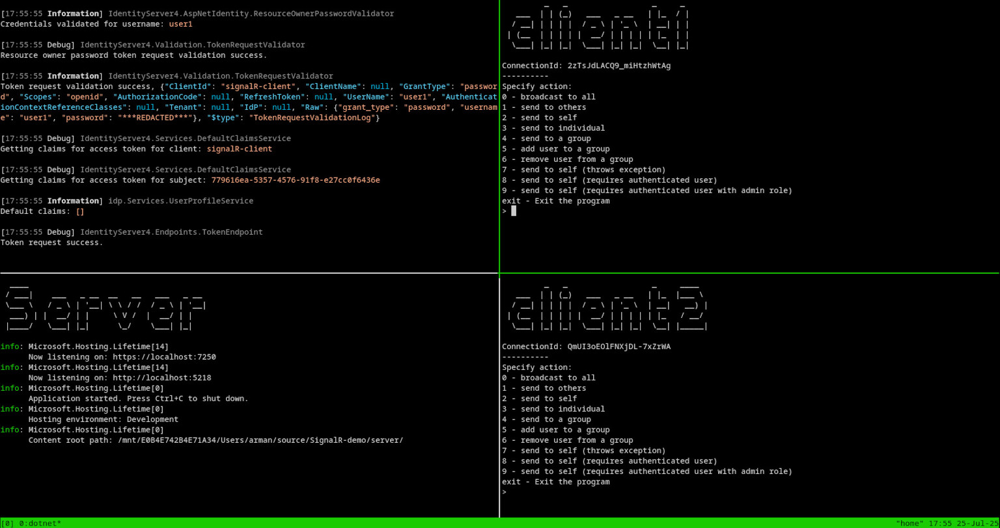

this is based on a book i was reading about signalr by [Fiodar Sazanavets](https://github.com/fiodarsazanavets) called [SignalR on .NET 6 - the Complete Guide](https://www.google.com/search?client=firefox-b-d&q=SignalR+on+.NET+6+-+the+Complete+Guide+Fiodar+Sazanavets)

solution contains 3 projects:
- server (asp.net core application hosting signalr hub)
- client (cli console application with multiple options for different scenarios)
- idp (asp.net core application handling access token generation using identityserver4)

build and run them seperately. optionally run multiple client instances to better see different features of library.
set client name as a argument like this: `dotnet run --project client client1`
